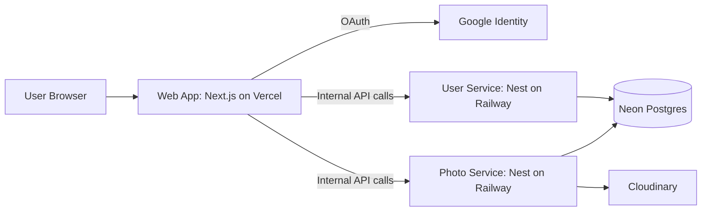

# Architecture, Tech Stack, Setup, Deployment, and System Flow

This document is the complete technical reference for this project.

- Why this architecture and stack were chosen
- What architecture and stack are currently applied
- How to run locally
- How to deploy step by step
- How the full system works at runtime

## 1. Decision Log: Tech Stack and Architecture

### 1.1 Product and Engineering Constraints

This take-home system needs to:

1. Support social-photo workflows with authentication, upload, listing, and comments.
2. Keep implementation simple enough for fast iteration and review.
3. Split concerns between identity/user domain and photo/media domain.
4. Be cloud deployable with minimal operational overhead.
5. Use a data model that can evolve safely over time.

### 1.2 Architecture Decision Summary

1. Architecture style: lightweight microservices with an API gateway pattern at the web layer.
2. Service boundaries:
   - user-service owns users and OAuth identity mapping.
   - photo-service owns photos, comments, and Cloudinary integration.
3. Data boundary strategy: one PostgreSQL database with separate schemas per service domain.
4. Auth strategy: NextAuth (Google OAuth) in web app + internal JWT for service-to-service and API authorization.
5. Deployment strategy: web on Vercel, backend services on Railway, managed Postgres on Neon, media on Cloudinary.

### 1.3 Why These Choices

- Next.js + NextAuth:
  - Fast UI/API iteration in one project.
  - Robust Google OAuth integration.
  - Good fit for SSR/App Router patterns.
- NestJS services:
  - Clear module/controller/service structure.
  - Type-safe DTO/validation patterns.
  - Good operational baseline for API services.
- Prisma + Postgres:
  - Strong schema and migration workflows.
  - Familiar relational model for users/photos/comments.
  - Multi-schema support for domain separation.
- Railway + Vercel + Neon + Cloudinary:
  - Rapid production setup.
  - Managed platform concerns (build, TLS, autoscaling baseline).
  - Clear separation of compute, database, and media assets.

### 1.4 Trade-offs Accepted

- One shared database with separate schemas is simpler than separate database instances, but migration naming must be globally unique across services.
- API gateway pattern in web layer simplifies browser integration and auth handling, but adds one extra hop.
- In-memory API route rate limiting is simple and cheap, but not distributed across replicas.

## 2. Applied Architecture (Current State)

## 2.1 High-Level Topology



## 2.2 Runtime Boundaries

- Web app responsibilities:
  - Handle OAuth with Google.
  - Maintain user session.
  - Proxy browser requests through server API routes.
  - Attach internal JWT when calling backend services.
- user-service responsibilities:
  - Sync OAuth identity to domain user record.
  - Issue internal JWT.
  - Provide current-user and public-profile data.
- photo-service responsibilities:
  - Upload and delete photo assets via Cloudinary.
  - Persist photo metadata and comments.
  - Enforce JWT auth for protected operations.
- Database responsibilities:
  - user_domain schema for user-service.
  - photo_domain schema for photo-service.

## 2.3 Data Model Boundaries

- user_domain
  - users
  - oauth_identities
- photo_domain
  - photos
  - comments

## 2.4 Auth and Trust Model

1. User signs in with Google via NextAuth.
2. Web app calls user-service internal sync endpoint.
3. user-service creates/updates user identity and returns internal JWT.
4. Web session stores internal JWT.
5. Web API routes forward requests to backend services with Authorization: Bearer <internal-jwt>.
6. Services validate JWT using shared INTERNAL_JWT_SECRET.

## 3. Applied Tech Stack (Current State)

| Layer | Technology | Why It Is Used |
|---|---|---|
| Frontend runtime | Next.js 16 + React 19 | App Router web app and server routes |
| Web authentication | next-auth v4 | Google OAuth and session handling |
| UI system | Ant Design | Fast UI composition for dashboard flows |
| Backend framework | NestJS 11 | Modular API services |
| ORM | Prisma 7 | Schema management and migrations |
| Database | PostgreSQL (Neon) | Relational model and managed hosting |
| Media storage | Cloudinary | Asset upload/storage/CDN |
| Package manager | pnpm workspaces | Monorepo dependency management |
| Backend hosting | Railway (Docker) | Managed container deployment |
| Web hosting | Vercel | Managed Next.js deployment |
| CI/CD | GitHub Actions | Build, migrate, deploy orchestration |

## 4. Local Setup (Step-by-Step)

## 4.1 Prerequisites

- Node.js 20+
- pnpm 10+
- Docker Desktop

## 4.2 Install Dependencies

From repository root:

```bash
pnpm install
```

## 4.3 Configure Environment Variables

1. Copy environment templates:

```bash
cp apps/web/.env.example apps/web/.env.local
cp services/user-service/.env.example services/user-service/.env
cp services/photo-service/.env.example services/photo-service/.env
```

2. Set local-safe values for:
- apps/web/.env.local
  - NEXTAUTH_SECRET
  - GOOGLE_CLIENT_ID
  - GOOGLE_CLIENT_SECRET
  - INTERNAL_JWT_SECRET
- services/user-service/.env
  - INTERNAL_JWT_SECRET
- services/photo-service/.env
  - INTERNAL_JWT_SECRET
  - CLOUDINARY_* variables

For local development, INTERNAL_JWT_SECRET must be identical in web, user-service, and photo-service.

## 4.4 Start Local Database

```bash
docker compose up -d
```

This starts Postgres and initializes schemas from infra/postgres/init.sql.

## 4.5 Run Migrations

```bash
pnpm --filter @qode/user-service prisma:migrate
pnpm --filter @qode/photo-service prisma:migrate
```

## 4.6 Start Services

Option A: start all three at once

```bash
pnpm dev
```

Option B: start each service manually

```bash
pnpm --filter @qode/user-service dev
pnpm --filter @qode/photo-service dev
pnpm --filter @qode/web dev
```

## 4.7 Verify Health and Basic Flow

```bash
curl http://localhost:4001/health
curl http://localhost:4002/health
```

Then open the web app at http://localhost:3000 and perform sign-in.

## 4.8 Local Troubleshooting

- If backend responds 401/Unauthorized:
  - verify INTERNAL_JWT_SECRET is identical across all apps.
- If OAuth callback fails:
  - verify GOOGLE_CLIENT_ID/GOOGLE_CLIENT_SECRET and callback URL config.
- If missing-table errors appear:
  - run prisma migrate commands again and verify DATABASE_URL schema suffix.

## 5. Deployment Guide (Step-by-Step)

This section is the practical deployment runbook.

## 5.1 Prepare Managed Services

1. Neon
   - create database (example: qode_photo)
   - use two schema-specific connection strings:
     - USER_SERVICE_DATABASE_URL ends with &schema=user_domain (or ?schema=user_domain if no existing query)
     - PHOTO_SERVICE_DATABASE_URL ends with &schema=photo_domain (or ?schema=photo_domain if no existing query)
2. Cloudinary
   - create environment and collect CLOUDINARY_* credentials
3. Google OAuth
   - set authorized origin and redirect URI for web domain

## 5.2 Deploy user-service to Railway

1. Create Railway service from this repo.
2. Configure build:
   - Root Directory: .
   - Dockerfile Path: services/user-service/Dockerfile
3. Set environment variables:
   - PORT=4001
   - DATABASE_URL=<USER_SERVICE_DATABASE_URL>
   - INTERNAL_JWT_SECRET=<shared-secret>
   - CORS_ORIGINS=https://<your-web-domain>
4. Deploy and verify /health.

## 5.3 Deploy photo-service to Railway

1. Create Railway service from this repo.
2. Configure build:
   - Root Directory: .
   - Dockerfile Path: services/photo-service/Dockerfile
3. Set environment variables:
   - PORT=4002
   - DATABASE_URL=<PHOTO_SERVICE_DATABASE_URL>
   - INTERNAL_JWT_SECRET=<shared-secret>
   - USER_SERVICE_URL=https://<user-service-domain>
   - CORS_ORIGINS=https://<your-web-domain>
   - CLOUDINARY_CLOUD_NAME
   - CLOUDINARY_API_KEY
   - CLOUDINARY_API_SECRET
   - CLOUDINARY_UPLOAD_FOLDER=qode-photo-takehome
4. Deploy and verify /health.

## 5.4 Deploy Web to Vercel

1. Import this repo into Vercel and set app root to apps/web.
2. Set environment variables:
   - NEXTAUTH_URL=https://<your-web-domain>
   - NEXTAUTH_SECRET=<secure-secret>
   - GOOGLE_CLIENT_ID
   - GOOGLE_CLIENT_SECRET
   - INTERNAL_JWT_SECRET=<shared-secret>
   - USER_SERVICE_URL=https://<user-service-domain>
   - PHOTO_SERVICE_URL=https://<photo-service-domain>
3. Deploy and verify sign-in.

## 5.5 Configure CI/CD Secrets (GitHub)

Set repository secrets used by .github/workflows/cd.yml:

- USER_SERVICE_DATABASE_URL
- PHOTO_SERVICE_DATABASE_URL
- USER_SERVICE_RAILWAY_DEPLOY_HOOK_URL
- PHOTO_SERVICE_RAILWAY_DEPLOY_HOOK_URL
- WEB_DEPLOY_HOOK_URL
- WEB_HEALTHCHECK_URL
- USER_SERVICE_HEALTHCHECK_URL
- PHOTO_SERVICE_HEALTHCHECK_URL
- GOOGLE_CLIENT_ID
- GOOGLE_CLIENT_SECRET
- NEXTAUTH_SECRET
- INTERNAL_JWT_SECRET
- CLOUDINARY_CLOUD_NAME
- CLOUDINARY_API_KEY
- CLOUDINARY_API_SECRET

## 5.6 Deployment Verification Checklist

1. GitHub CD run succeeds from migrate to healthcheck job.
2. Both service health endpoints return status ok.
3. Web /api/auth/providers works.
4. Google sign-in completes without callback error.
5. /api/photos returns authenticated results.

## 5.7 Production Pitfalls to Avoid

- Do not use a malformed DB URL query string.
  - Wrong: ...?sslmode=require&channel_binding=require?schema=photo_domain
  - Correct: ...?sslmode=require&channel_binding=require&schema=photo_domain
- Do not reuse migration folder names across services when they share one database.
  - Migration names should be globally unique.

## 6. System Working Flow

## 6.1 Login and User Synchronization Flow

1. Browser initiates Google login.
2. NextAuth callback receives Google profile.
3. Web backend calls user-service internal endpoint:
   - POST /internal/users/sync-oauth
4. user-service upserts user + oauth identity in user_domain.
5. user-service returns internal JWT + user profile.
6. Web session stores backendAccessToken.

## 6.2 Profile Retrieval Flow

1. Browser calls GET /api/me on web app.
2. Web validates session, reads backendAccessToken.
3. Web forwards request to user-service GET /users/me.
4. user-service validates JWT and returns profile.
5. Web returns normalized response to browser.

## 6.3 Photo Upload Flow

1. Browser submits multipart/form-data to POST /api/photos.
2. Web enforces API route rate-limit.
3. Web forwards multipart request to photo-service POST /photos with bearer token.
4. photo-service validates file constraints and JWT.
5. photo-service uploads asset to Cloudinary.
6. photo-service persists metadata in photo_domain.photos.
7. Response is returned through web API route.

## 6.4 Comment Creation Flow

1. Browser calls POST /api/photos/:id/comments.
2. Web enforces API route rate-limit.
3. Web forwards request to photo-service.
4. photo-service validates JWT + payload.
5. photo-service writes record to photo_domain.comments.
6. Response is returned to browser.

## 6.5 Delete Flows

- Delete photo:
  - Browser -> web API -> photo-service DELETE /photos/:photoId
  - photo-service checks ownership/admin, removes Cloudinary asset, deletes DB row.
- Delete comment:
  - Browser -> web API -> photo-service DELETE /comments/:id
  - photo-service checks ownership/admin and deletes row.

## 6.6 Error Handling Flow

- Web API routes normalize proxy errors with consistent status/error JSON.
- Nest services use exception filters and request logging interceptors.
- Health endpoints support quick post-deploy diagnosis.

## 7. Operating Guidelines

1. Keep INTERNAL_JWT_SECRET synchronized across web, user-service, and photo-service.
2. Keep migration names unique across all services sharing the same database.
3. Keep CORS_ORIGINS restricted to trusted web origins.
4. Never expose backend secrets in client-side environment variables.
5. Run migration deploy before traffic cutover in every production release.
